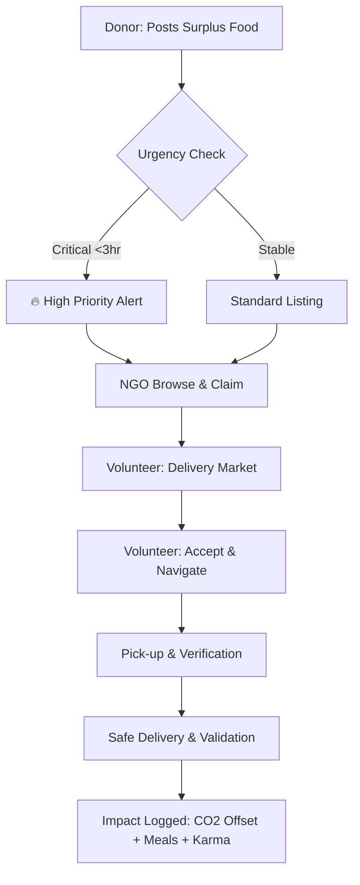

# FoodBridge 🌿 | Social Enterprise Logistics & Sustainability System

**A powerful, real-time logistics engine connecting surplus food generators with those in need.**

FoodBridge is more than a management tool — it's a "Social Enterprise" ecosystem. It transforms surplus food from hotels, restaurants, and event venues into survival resources for NGOs and local communities using an intelligent, role-based logistics network.

---

## 🚀 The Impact Engine (Key Features)

### 📊 Sustainability Analytics (CSR Dashboard)
Every action on FoodBridge contributes to a greener planet. Our **Mission Control Dashboard** calculates real-time Corporate Social Responsibility (CSR) metrics:
- **CO2 Offset**: Automatically calculates environmental impact based on food weight salvaged.
- **Meals Provided**: Real-time counter of community impact.
- **Volunteer Karma**: A gamified reputation system rewarding volunteers for successful deliveries.

### ☀️ Universal Theme Engine 2.0
A premium user experience with multi-mode transition support:
- **Dark Mode**: Optimized for low-light "Mission Control" monitoring.
- **Light Mode**: High-contrast, professional "Social Enterprise" aesthetic.
- **System Sync**: Automatically adapts to your OS settings for a seamless feel.

### ⚡ Intelligence Expiry Engine (Urgency Tracking)
Donations aren't just listed — they are prioritized.
- **Flash-Discovery**: Items expiring in <3 hours pulse red with an **URGENT** warning.
- **Smart Sorting**: The system prioritizes the most critical food items to ensure zero-waste.

### 📍 Precision Logistics & Tracking
- **Interactive Mapbox Integration**: Real-time location picking and delivery tracking.
- **Secure Handoff**: Verified organization badges and organization verification systems.

---

## 🔄 The Lifecycle Workflow (Donation Journey)



---

## 👤 Role-Based Mission Control

| Role | Mission | Primary Dashboard |
| :--- | :--- | :--- |
| **Donor** | Community Contribution | **My Recent Impact**: Impact metrics & Donation History. |
| **NGO** | Community Support | **Claim Hub**: Active Claims, Expiring Food Radar. |
| **Volunteer** | Logistics Champion | **Mission Hub**: Active Deliveries, Karma Points, Delivery Market. |
| **Admin** | Platform Optimizer | **Control Center**: User Verification, Global Analytics. |

---

## 🛠️ Technical Architecture

### Core Tech Stack
- **Frontend**: React.js (Vite) + Context API for Global Theme/Auth logic.
- **Backend**: Node.js + Express.js + Mongoose (MongoDB).
- **Interactive**: Mapbox GL JS for logistics and real-time tracking.
- **Performance**: Zero-Layout-Shift design with Shimmer-based **Skeleton Loading**.

### Key Infrastructure
- **Real-time Notifications**: Custom event-driven notification engine.
- **Reputation System**: Model-level karma incrementation for verified actions.
- **Design Tokens**: Centralized CSS variables for "Theme 2.0" support.

---

## 🏁 Getting Started (Developer Setup)

### 1. Prerequisites
- **Node.js**: 18+
- **MongoDB**: Local instance or Atlas URI
- **Mapbox API Token**: For interactive maps

### 2. Installations
```bash
# Clone the FoodBridge ecosystem
git clone <repository-url>

# Setup Server
cd server && npm install

# Setup Client
cd ../client && npm install
```

### 3. Environment Configuration (`.env`)
Create a `.env` in the `/server` directory:
```env
PORT=5000
MONGODB_URI=your_mongodb_connection_string
JWT_SECRET=your_secure_secret_key
MAPBOX_ACCESS_TOKEN=your_mapbox_token
```

### 4. Launching the Platform
```bash
# Terminal 1: Mission Control (Backend)
cd server && node server.js

# Terminal 2: Strategic UI (Frontend)
cd client && npm run dev
```

---

## 📄 Platform Credits
*Built with ❤️ for the 2026 Academic Major Program — Towards a Zero-Waste Future.*
