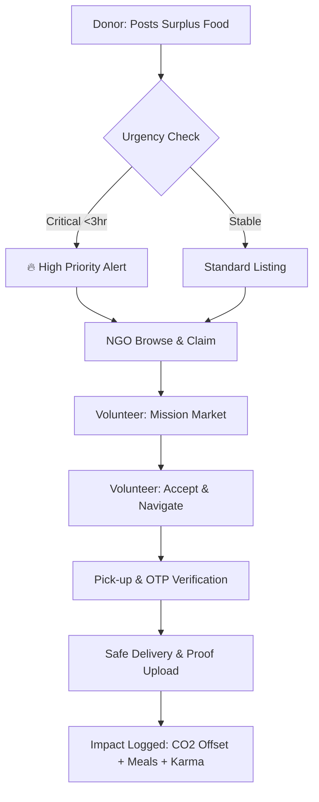

# FoodBridge 🌿 | High-Efficiency Zero-Waste Logistics & Community Sustainability Platform

**Empowering communities by bridging the gap between surplus food generators and those in need through a resilient, role-based logistics network.**

FoodBridge is a "Social Enterprise" ecosystem designed to solve the critical problem of food waste in the hospitality sector. It transforms surplus food from hotels, restaurants, and corporate venues into survival resources for NGOs and local communities using an intelligent, real-time logistics engine.

---

## 🚀 The Impact Engine (Actual Implementation)

### 📊 Multi-Dimensional CSR Analytics
Every action on FoodBridge contributes to a greener planet. Our **Mission Control Dashboard** calculates real-time Corporate Social Responsibility (CSR) metrics:
- **CO2 Offset**: Automatically calculates environmental impact based on food weight salvaged (Preventing Landfill Methane).
- **Meals Provided**: Real-time counter of community impact.
- **Volunteer Karma**: A gamified reputation system rewarding volunteers with +10 points for every successful mission.

### 📍 Precision Logistics & Zomato-Style Tracking
- **Interactive Leaflet Integration**: High-precision location selection for Donors and Receivers.
- **Live Mission Tracking**: NGOs can monitor volunteer movement in real-time during "In-Transit" missions.
- **Geofencing**: Automatic nearby notifications for NGOs and Volunteers when new food becomes available.

### 🛡️ Secure Handoff Protocol (OTP Verification)
Safety and accountability are enforced through a unique **Two-Factor Verification** system:
- **Pickup Code**: Donors provide a 4-digit code to the volunteer to authorize food collection.
- **Delivery Code**: Receivers provide a 4-digit code to the volunteer to finalize the mission.
- **Digital Proof**: Volunteers capture and upload "Proof of Distribution" photos directly to the transaction log.

### ⚡ Intelligence Expiry Engine (Flash-Discovery)
Donations aren't just listed — they are prioritized based on safety and freshness.
- **Urgency Thresholds**: Items expiring in <3 hours are flagged as **CRITICAL**.
- **Smart Sorting**: The system automatically surfaces urgent items to the top of the NGO and Volunteer feeds.

---

## 🔄 The Logistics Lifecycle



---

## 👤 Unified Role Ecosystem

| Role | Mission | Primary Dashboard |
| :--- | :--- | :--- |
| **Donor** | Community Contribution | **Impact Hub**: CSR metrics, CO2 offset, & Donation History. |
| **NGO** | Community Support | **Claim Radar**: Active Claims, Warehouse Management, Receiver Matching. |
| **Volunteer** | Logistics Champion | **Mission Hub**: Active Deliveries, Karma Points, Live Tracking. |
| **Receiver** | Direct Beneficiary | **Requirement Hub**: Food Requests, Delivery Tracking. |
| **Admin** | Platform Optimizer | **Control Center**: User Verification, Global Analytics, System Health. |

---

## 🛠️ Technical Blueprint

### Core Tech Stack
- **Frontend**: React.js (Vite) + Context API for Global State (Auth, Theme, Notifications).
- **Backend**: Node.js + Express.js + Mongoose (MongoDB).
- **Mapping**: Leaflet.js (UI MapPicker) & Mapbox GL JS (Mission Tracking).
- **Security**: JWT-based Authentication with Role-Based Access Control (RBAC).

---

## 🏁 Quick-Start Guide

### 1. Installations
```bash
# Clone the FoodBridge ecosystem
git clone <repository-url>

# Setup Server
cd server && npm install

# Setup Client
cd ../client && npm install
```

### 2. Launching the Platform
```bash
# Terminal 1: Mission Control (Backend)
cd server && node server.js

# Terminal 2: Strategic UI (Frontend)
cd client && npm run dev
```

---

## 📄 Documentation
For a deep dive into the project's technical implementation, database schema, and CSR formulas, refer to [DOCUMENTATION.md](./DOCUMENTATION.md).

---

*Built with ❤️ for the 2026 Academic Major Program — Towards a Zero-Waste Future.*
